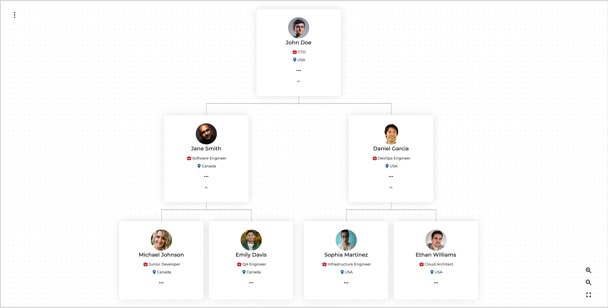
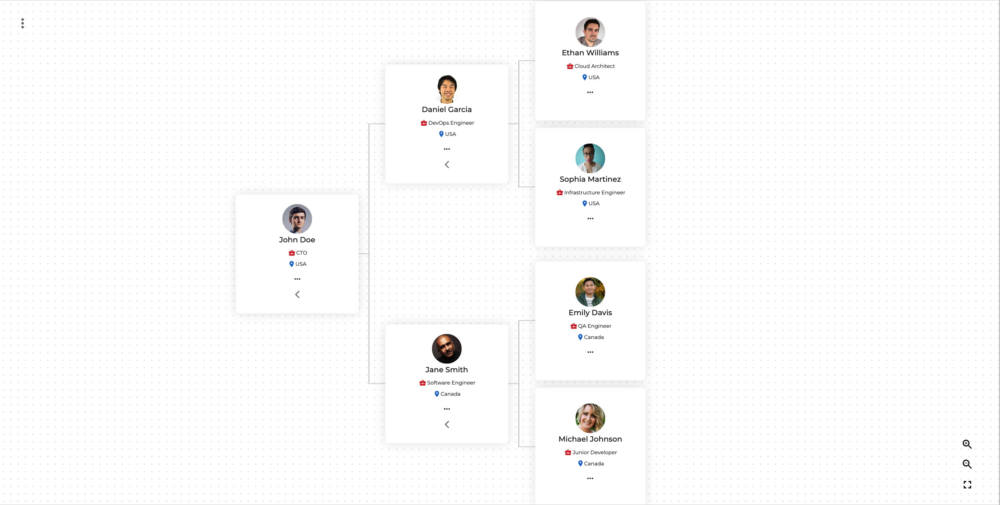

# **🚀 `hubino-Hierarchy`**


A highly customizable and interactive hierarchy (organization chart) component built with React. Ideal for visualizing organizational structures with powerful features like infinite drag, adjustable layouts, smooth transitions, and export options.

## **✨ Features**

- 🏗️ **Multiple Layouts**: View your hierarchy in both **horizontal** and **vertical** orientations.
- 🔍 **Infinite Drag & Zoom**: Smooth panning and zooming with grid-based snapping.
- 🔄 **Expand/Collapse All**: Control the visibility of different levels in the hierarchy.
- 🎨 **Customizable Nodes**: Fully configurable node structure with rich content and styling options.
- 📦 **Drag & Drop Support**: Seamlessly rearrange nodes within the hierarchy.
- 📏 **Dynamic Resizing**: Adjustable height and width of the hierarchy container.
- 📥 **Export Options**: Download your hierarchy as **PDF** or **image** for offline use.
- 🎭 **Modern UI**: Stunning card design with smooth transitions and interactive elements.
- ⚛️ **Built with React**: Optimized for performance and seamless integration with React applications.

## **📦 Installation**

To install the package, run:

```bash
npm install https://bitbucket.org/hubino/hubino-reactjs-hierarchy/raw/main/hubino-hierarchy-1.0.0.tgz
```

## **🚀 Usage**

Here’s a basic example of how to use the hierarchy component in your React application:

```jsx
import OrgChart from "./OrgChart";
import { Box, Typography } from "@mui/material";
import { dataSet } from "./data/sampleData";

function App() {
  const sampleData = [
    {
      id: "1",
      name: "John Doe",
      title: "CTO",
      description:
        "Chief Technology Officer with 10+ years of experience in leading tech teams.",
      region: "USA",
      status: "NORM",
      imageUrl: "https://randomuser.me/api/portraits/men/1.jpg",
      children: [
        {
          id: "1.1",
          name: "Jane Smith",
          title: "Software Engineer",
          description:
            "Full-stack developer specializing in web technologies and cloud infrastructure.",
          region: "Canada",
          status: "NORM",
          imageUrl: "https://randomuser.me/api/portraits/men/5.jpg",
          children: [
            {
              id: "1.1.1",
              name: "Michael Johnson",
              title: "Junior Developer",
              description:
                "Frontend developer focusing on React and UI development.",
              region: "Canada",
              status: "WARN",
              imageUrl: "https://randomuser.me/api/portraits/women/3.jpg",
            },
            {
              id: "1.1.2",
              name: "Emily Davis",
              title: "QA Engineer",
              description:
                "Ensures software quality through testing and process optimization.",
              region: "Canada",
              status: "NORM",
              imageUrl: "https://randomuser.me/api/portraits/men/4.jpg",
            },
          ],
        },
        {
          id: "1.2",
          name: "Daniel Garcia",
          title: "DevOps Engineer",
          description:
            "Manages cloud infrastructure and deployment pipelines and has Foundational skills.",
          region: "USA",
          status: "CRIT",
          imageUrl: "https://randomuser.me/api/portraits/men/90.jpg",
          children: [
            {
              id: "1.2.1",
              name: "Sophia Martinez",
              title: "Infrastructure Engineer",
              description:
                "Specializes in server management and cloud services.",
              region: "USA",
              status: "NORM",
              imageUrl: "https://randomuser.me/api/portraits/women/6.jpg",
            },
            {
              id: "1.2.2",
              name: "Ethan Williams",
              title: "Cloud Architect",
              description:
                "Designs and implements cloud solutions for scalability.",
              region: "USA",
              status: "NORM",
              imageUrl: "https://randomuser.me/api/portraits/men/20.jpg",
            },
          ],
        },
      ],
    },
  ];

  const fontValues = {
    fontFamily: "sans-serif", // Users can set their preferred font family.
    fontColor: "red", // Customize the font color with any valid color code.
  };

  return (
    <>
      <Typography variant="h4">🚀 Hubino Hierarchy</Typography>
      <Box
        sx={{
          margin: "auto",
          width: "60%",
          height: "400px",
        }}
      >
        <OrgChart
          nodeData={sampleData} // Node data for rendering the organization chart.
          fontValues={fontValues} // Custom font styles if users want to apply their own design preferences.
          height={"600px"} // Adjust the height as needed.
          width={"50%"} // Adjust the width as needed.
        />
      </Box>
    </>
  );
}

export default App;
```

## **⚙️ Props**

| Prop Name    | Type     | Default  | Description                                       |
| ------------ | -------- | -------- | ------------------------------------------------- |
| `nodeData`   | `array`  | `[]`     | The hierarchical data structure containing nodes. |
| `fontValues` | `object` | `{}`     | Customize font styles for hierarchy nodes.        |
| `height`     | `string` | `'auto'` | Defines the height of the hierarchy container.    |
| `width`      | `string` | `'auto'` | Defines the width of the hierarchy container.     |

## **🖼️ Screenshots**

### **📌 Vertical Layout**



### **📌 Horizontal Layout**



## **🛠️ Customization**

You can customize the appearance and functionality of the hierarchy component by passing props. For example:

```jsx
<OrgChart
  nodeData={sampleData}
  fontValues={{ fontSize: "14px", fontWeight: "bold" }}
  height="700px"
  width="80%"
/>
```

## **🤝 Contributing**

Contributions are welcome! If you’d like to contribute, please fork the repository and use a feature branch. Pull requests are warmly encouraged.

## **🎖️ Acknowledgments**

- Thanks to the **Hubino Team** & **React community** for the inspiration and support.
- Special thanks to **[d3.js]** and **[React-Flow]** for inspiration in visualization.

## 📜 License

[MIT](https://opensource.org/licenses/MIT)

---

## 🌟 Support & Feedback

If you like this project, please ⭐️ it on GitHub!

📧 Need help? Contact [support@hubino.com](mailto:emp@hubino.com)

---
